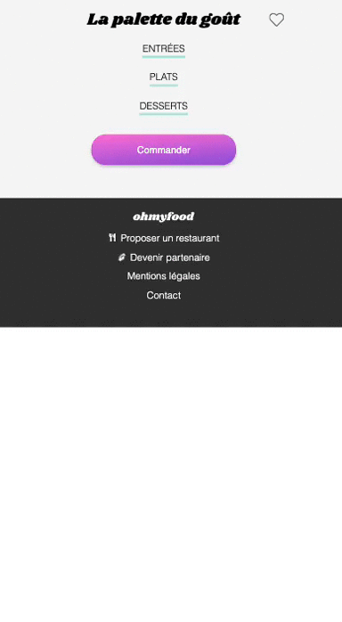
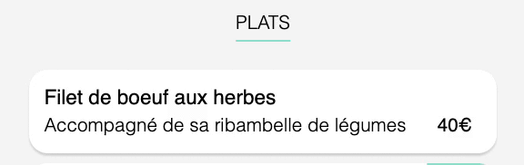

# Projet Ohmyfood : Dynamiser une page web avec des animations CSS
### Projet de création d'un site web de réservation de menus de restaurants version mobile (compatible aussi Desktop & Tablets). 
### Travail à partir d'une maquette de la version mobile et d'un cahier des charges des fonctionnalités à réaliser 
### Les animations CSS 3 et 4 étaient à reproduire à l'identique du cahier des charges et les animations 1 et 2 à concevoir de A à Z.  

## <a href="https://fabhup.github.io/Fabienhupel_3_06022021/">Lien vers le site réalisé</a> 

## Aperçu des animations CSS réalisées : 
 - <strong> Animation 1 : Logo Ohmyfood </strong> 
    Logo en mode "progressbar" avec une balle qui rebondit sur les lettres du logo 
    Déclenchement au chargement de la page index.html  
     

 - <strong> Animation 2 : Load Spinner </strong> 
    Affichage d'un load spinner avec icônes "couteau" et "fourchette" en rotation 
    Déclenchement au chargement des pages de restaurants  
      
    
 - <strong> Animation 3 : Affichage progressif des menus </strong> 
    Affichage des menus en décalage avec translateY et opacity progressive  
    Déclenchement après la fin de l'Animation 2 Load Spinner Restaurants  
      
    
 - <strong> Animation 4 : Validation du choix d'un plat </strong> 
    Affichage d'une icône "check" après avoir sélectionné un plat  
    Déclenchement au survol d'un plat (au clic sur mobile)  
      

